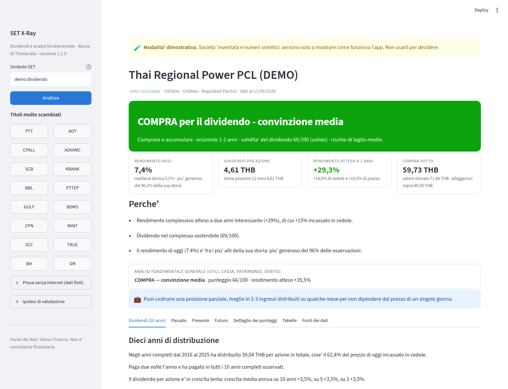
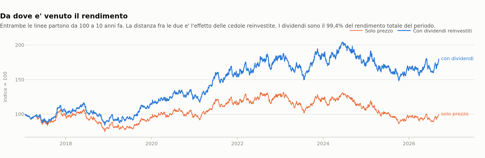
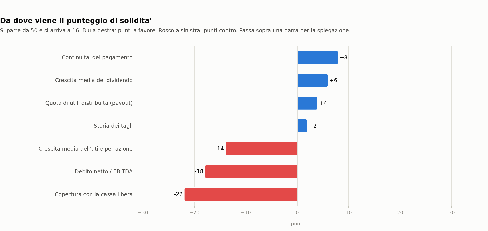

# SET X-Ray

Analisi dei **dividendi degli ultimi dieci anni** di un'azione della **Stock
Exchange of Thailand**, con un segnale operativo spiegato.

Dai un simbolo — `PTT`, `AOT`, `CPALL` — e lo strumento ricostruisce ogni stacco
degli ultimi dieci anni, misura crescita, tagli e continuità, calcola quanta
parte del rendimento è arrivata dalle cedole invece che dal prezzo, valuta se il
dividendo regge, stima cosa pagherà nei prossimi due anni, e risponde a una sola
domanda:

> **Compro, mantengo o vendo? E perché?**

L'orizzonte è **1-2 anni minimo**. Non è uno strumento di trading.



Il caso che conta: dieci anni di stacchi con il taglio del 2020 segnato in rosso
e la stima dei prossimi due anni con la sua forchetta.


Quanto del rendimento è arrivato dalle cedole e quanto dal prezzo.



Da dove viene il punteggio di solidità, fattore per fattore.



---

## Installazione e uso

Serve Python 3.10 o successivo.

```bash
pip install -r requirements.txt
streamlit run app.py
```

Da terminale:

```bash
python -m setxray PTT                 # analisi completa
python -m setxray PTT --dividendi      # solo i dividendi a dieci anni
python -m setxray --fonti              # quali archivi sono attivi
python -m setxray AOT --report aot.md   # salva il report in markdown
python -m setxray demo:tagliato         # dati finti, senza internet
```

Come libreria:

```python
from setxray import analyze

a = analyze("PTT")
print(a.dividends.signal.headline)         # "COMPRA per il dividendo - convinzione media"
print(a.dividends.yield_stats["attuale"])   # 0.0612
print(a.dividends.safety.score)             # 71
print(a.report())
```

### Senza internet

Sei aziende inventate coprono i casi tipici. I numeri sono sintetici e le
società non esistono.

| Profilo | Cosa rappresenta |
|---|---|
| `demo:dividendo` | cedola generosa e crescente da dieci anni, prezzo ragionevole |
| `demo:tagliato` | **ha tagliato il 55% nel 2020**: oggi rende il 14% perché il prezzo è crollato |
| `demo:irregolare` | paga solo negli anni buoni, ne salta quattro su dieci |
| `demo:solida` | azienda in crescita, conti sani, prezzo sotto la sua media |
| `demo:cara` | buona azienda pagata molto più di quanto sia mai valsa |
| `demo:difficolta` | non distribuisce: perdite, debito, cassa negativa |

`demo:tagliato` è quello che conta di più: mostra come lo strumento distingue un
rendimento alto perché il titolo è a sconto da un rendimento alto perché il
mercato si aspetta un altro taglio.

---

## Le fonti dei dati

Sui titoli thailandesi il dividendo è il dato più facile da sbagliare: Yahoo
Finance a volte salta uno stacco, a volte confonde baht e satang, a volte
registra la data con qualche giorno di scarto. Su dieci anni questi errori
cambiano le conclusioni.

Per questo lo strumento **interroga più archivi, tiene la serie più lunga e
dichiara dove le fonti non vanno d'accordo** — senza tentare di riconciliarle:
sapere che due archivi divergono vale più di una media fra i due.

| Fonte | Chiave | Come si attiva | Note |
|---|---|---|---|
| **SET (sito ufficiale)** | non serve | attiva | La fonte autorevole. L'interfaccia pubblica non è documentata: prova più indirizzi e si può imporre il proprio con `SETXRAY_SET_API`. **Da verificare al primo uso.** |
| **File CSV locale** | non serve | attiva | Funziona sempre, non dipende da nessuna API. Vedi sotto. |
| **EOD Historical Data** | `EODHD_API_KEY` | chiave gratuita su eodhd.com | Buona copertura dei dividendi asiatici. |
| **Financial Modeling Prep** | `FMP_API_KEY` | chiave gratuita su financialmodelingprep.com | Piano gratuito limitato. |
| **Alpha Vantage** | `ALPHAVANTAGE_API_KEY` | chiave gratuita su alphavantage.co | 25 chiamate al giorno; suffisso `.BKK`. |
| **Yahoo Finance** | non serve | attiva | Sempre disponibile, la meno affidabile sui titoli SET: resta la riserva. |

```bash
export EODHD_API_KEY=...          # attiva una fonte
export SETXRAY_SOURCES=csv,yahoo   # limita le fonti (più veloce)
python -m setxray --fonti           # verifica cosa è attivo
```

### Il percorso che funziona sempre: il CSV

Nessuna API è garantita nel tempo. Questa strada no. Copia dal sito della SET la
tabella degli stacchi e salvala come `dati/<SIMBOLO>-dividendi.csv`:

```
data,importo
2016-04-25,1.10
2016-09-05,1.10
2017-04-24,1.20
```

Vanno bene anche `date,dividend`, il punto e virgola come separatore e la virgola
decimale. **Le date si leggono con il giorno prima del mese**, come scrive la SET
(`05/09/2024` è il 5 settembre). Il file viene trattato come la fonte più
affidabile e usato al posto delle API.

Prezzi, bilanci e flussi di cassa arrivano da Yahoo Finance: lì la copertura è
buona anche sui titoli SET.

---

## Cosa calcola, e come

### 1. Dieci anni di distribuzione

Dividendo per azione anno per anno, con l'anno in corso tenuto fuori da ogni
media (è incompleto per definizione). Crescita media a 3, 5 e 10 anni; tagli con
il loro anno e la loro entità; anni saltati; aumenti consecutivi; cadenza degli
stacchi.

Due accortezze che cambiano i numeri:

- **Tagli e aumenti si contano solo fra anni solari consecutivi.** Un titolo che
  salta il 2020 e il 2021 non ha "tagliato" passando dal 2019 al 2022.
- **Con un anno a zero dentro la finestra, la crescita media non viene
  calcolata.** Su un pagatore irregolare un CAGR non significa niente, e
  dichiararlo assente è più utile che inventarlo.

### 2. Quanto del rendimento è venuto dalle cedole

Rendimento totale a dieci anni con i dividendi reinvestiti a ogni stacco,
confrontato con il solo prezzo. Su un titolo da reddito è il numero che dice se
la promessa è stata mantenuta: un prezzo fermo da dieci anni con un 6% annuo
incassato non è un investimento fallito. **La quota può superare il 100%**: se il
prezzo è scesso, le cedole hanno prodotto tutto il rendimento e coperto anche la
perdita.

### 3. Il prezzo di oggi è generoso?

Il rendimento attuale viene confrontato con la **propria** storia, non con una
media di mercato: oltre duemila osservazioni giornaliere su dieci anni, con
mediana, quartili e percentile.

Un dettaglio che sembra tecnico e non lo è: la serie storica e il rendimento di
oggi usano **lo stesso criterio** (gli ultimi N stacchi su base annua, con N la
cadenza abituale). Una finestra di 365 giorni su stacchi a date quasi fisse ne
racchiude ora due e ora uno a seconda del giorno, e il percentile finirebbe per
confrontare due misure diverse.

### 4. Il dividendo regge?

Un punteggio 0-100 che parte da 50 e somma i punti di sette fattori, **ognuno
visibile con i suoi punti e la sua spiegazione**: quota di utili distribuita,
copertura con la cassa libera vera, debito netto/EBITDA, andamento degli utili,
storia dei tagli, continuità del pagamento, crescita del dividendo.

È **una regola dichiarata, non un modello statistico addestrato** su una base
storica di tagli. Il vantaggio è che si può vedere da dove viene il numero e non
essere d'accordo su un fattore.

Tre correttivi imparati sui casi veri:

- La crescita del dividendo usa la misura **più prudente** fra 5 e 10 anni: dopo
  un taglio la media a cinque anni misura la risalita dal minimo e premierebbe
  proprio chi ha tagliato.
- Chi **salta anni** non può superare 45 punti (35 se ne salta tre o più), per
  quanto sia prudente il payout negli anni in cui paga.
- Un rendimento oltre **1,7 volte** la propria mediana alza il rischio di taglio:
  quando la cedola rende molto più del solito, di norma il mercato sta già
  scontando qualcosa.

### 5. Cosa pagherà nei prossimi due anni

Tre metodi indipendenti, pesati e tenuti visibili: **tendenza storica smorzata**
(la crescita passata usata al 60%, perché una retta sui logaritmi estrapola con
troppa sicurezza), **quota di utili sull'utile atteso**, **quota della cassa
libera**. Ne esce una forchetta, non un numero secco. Quando il rischio di taglio
è alto, lo scenario pessimistico assume una riduzione del 40-50%.

### 6. Il segnale, e perché

La valutazione è il ritorno del rendimento verso la sua mediana: se il titolo ha
reso storicamente il 5% e oggi rende il 7%, a dividendo confermato il prezzo
"normale" è più alto. A questo si aggiungono due anni di cedole incassate.

Tre freni, tutti nati da errori visti in collaudo:

- **Il ritorno alla mediana si assume solo a metà.** Se il prezzo ha avuto una
  tendenza lunga, la vecchia mediana descrive un'azienda e un mercato diversi da
  quelli di oggi.
- **Un dividendo fragile merita in modo permanente un rendimento più alto.** Sotto
  60 punti di solidità il rendimento obiettivo viene alzato fino al +90%: chi
  assume il ritorno alla vecchia mediana sta scommettendo che l'azienda torni
  quella di prima.
- **Quando un taglio è probabile, il titolo si valuta sul dividendo tagliato.** È
  l'errore più costoso di un modello sui dividendi: senza questo correttivo il
  profilo `demo:tagliato` dava **+112%** di rendimento atteso a due anni su
  un'azienda il cui dividendo era a rischio. Con il correttivo dà -35%.

Prezzo d'ingresso, valore stimato e prezzo di alleggerimento nascono dallo stesso
rendimento obiettivo, così i tre numeri non raccontano storie diverse: si compra
quando la cedola rende un quinto in più di quanto il titolo merita, si alleggerisce
quando rende un quinto in meno.

### 7. Il segnale ha mai funzionato su questo titolo?

Questa parte è misurata, non affermata. Per ogni fine mese degli ultimi dieci anni
lo strumento guarda in che percentile stava il rendimento rispetto ai tre anni
precedenti, e misura il rendimento totale dei **due anni successivi**. Poi
confronta i gruppi.

I limiti sono dichiarati accanto al risultato: un titolo solo, un periodo solo,
finestre di due anni che si sovrappongono (le osservazioni indipendenti sono molte
meno di quelle contate). Se un gruppo ha meno di sei osservazioni il confronto non
viene fatto. È un indizio su come si è comportato questo titolo, non una regola
generale.

### Intorno ai dividendi: l'analisi fondamentale

Resta l'analisi generale — valutazione, qualità del business, crescita, solidità
finanziaria, tendenza del prezzo, quattro modelli di valutazione — perché è quella
che dice se la cedola è sostenuta dai conti. **Quando i due modelli non
concordano, l'app lo dichiara** invece di fare una media: guardano cose diverse, e
la divergenza è informativa. Su `demo:tagliato` il modello generale vede un titolo
a sconto sugli utili e quello sui dividendi vede una cedola che non regge: è il
profilo tipico di una trappola di valore.

---

## Struttura

```
app.py                 interfaccia web (Streamlit)
setxray/
  sources/             le fonti alternative
    base.py            astrazione, lettura difensiva dei JSON, confronto fra fonti
    setofficial.py     sito ufficiale SET · csvfile.py  file locale
    eodhd.py · fmp.py · alphavantage.py · yahoo.py
  dividends.py         il motore: storia, solidità, previsione, segnale, verifica
  datasource.py        prezzi e bilanci da Yahoo Finance, cache, simboli SET
  metrics.py           bilanci -> metriche (margini, ROE/ROIC, debito, multipli)
  valuation.py         quattro modelli di valutazione e il costo del capitale
  scoring.py           cinque pilastri, campanelli d'allarme, verdetto generale
  narrative.py         il racconto in italiano + report markdown
  charts.py            diciotto grafici (Plotly)
  engine.py            analyze(): il filo che unisce tutto
  cli.py · demo.py · fmt.py
tests/                 273 test, tutti eseguibili senza rete
```

I grafici seguono due regole non negoziabili: **mai due assi verticali** nello
stesso riquadro (due unità diverse diventano due grafici), e la palette è
verificata per il daltonismo con il valore sempre scritto accanto al colore.

## Test

```bash
python -m pytest tests/ -q
```

Non toccano la rete, e non devono: usano i profili dimostrativi, un `yfinance`
simulato e le risposte JSON reali di ogni servizio registrate come dati di prova
(comprese Yahoo che non risponde, risposte vuote e nomi di colonna cambiati).

## Limiti da conoscere

- **Le API dei dividendi non sono state provate contro i servizi veri** durante
  lo sviluppo: la rete dell'ambiente di lavoro le bloccava tutte. Le forme delle
  risposte sono coperte dai test, ma **verifica l'esito al primo uso** — il
  comando `python -m setxray PTT --dividendi` mostra in fondo quale fonte è stata
  usata e se le altre concordano. Il percorso CSV non ha questo dubbio.
- **Yahoo Finance dà quattro esercizi di bilancio**, non dieci: payout e copertura
  con la cassa si possono ricostruire solo per gli ultimi quattro anni, mentre
  dividendi e prezzi coprono dieci anni pieni.
- **Yahoo limita le richieste.** C'è una cache locale di un'ora
  (`~/.cache/setxray`); se ricevi errori, aspetta qualche minuto.
- **Il cambio non è previsto.** Il titolo è in baht: per chi investe in euro il
  rendimento finale dipende anche da EUR/THB.
- **La previsione del dividendo è un'estrapolazione dai dati di bilancio**, non
  una lettura delle intenzioni dell'azienda. Un annuncio di investimenti, una
  acquisizione o un cambio di politica di distribuzione non ci sono dentro.

## Avvertenza

Questa applicazione è un'elaborazione automatica di dati pubblici. **Non è
consulenza finanziaria e non è una raccomandazione personalizzata.** Prima di
investire verifica sempre i numeri sui bilanci ufficiali della società e sul sito
della Stock Exchange of Thailand, e considera la tua situazione personale.
