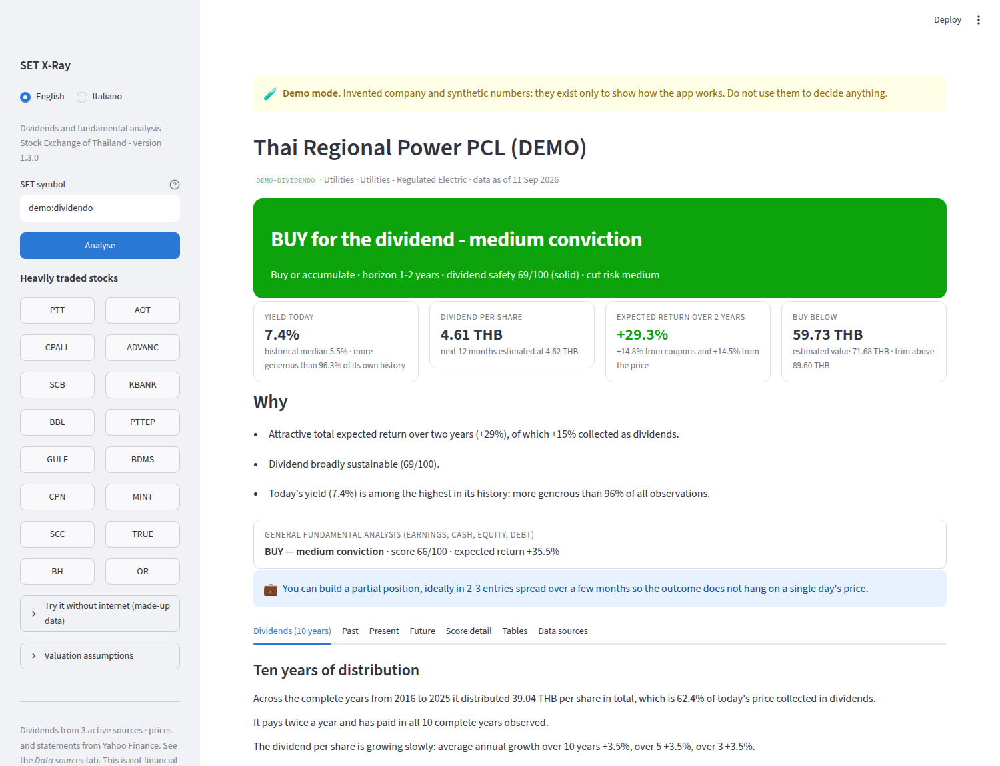
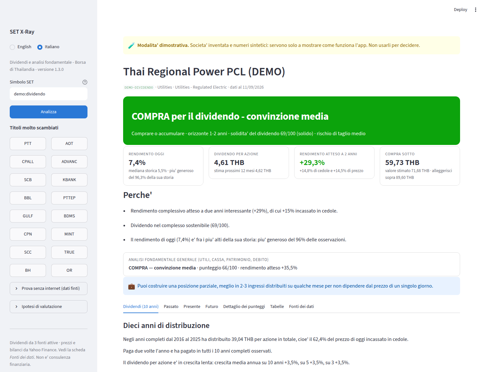
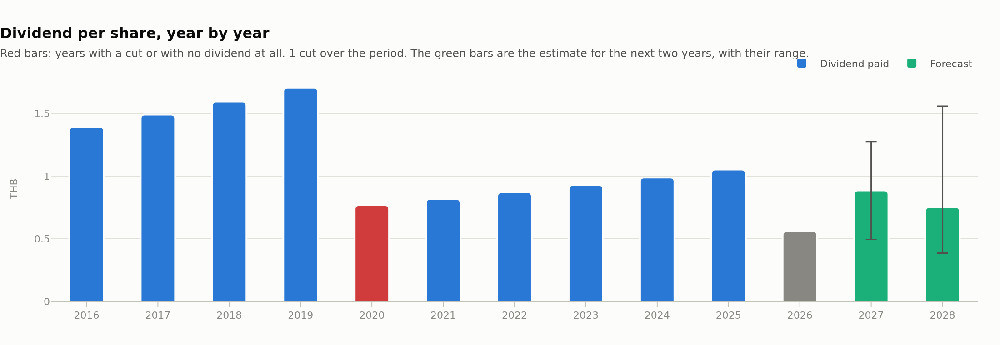
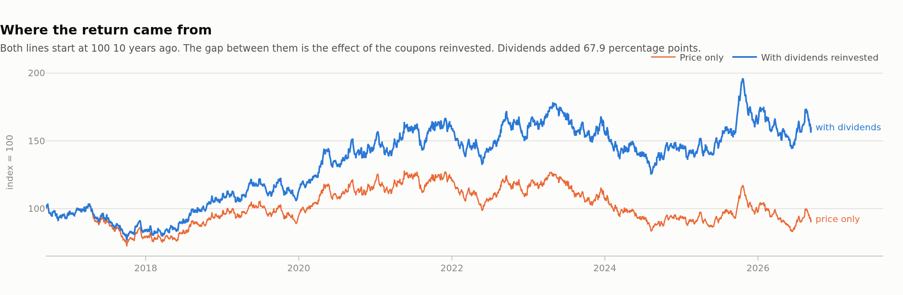
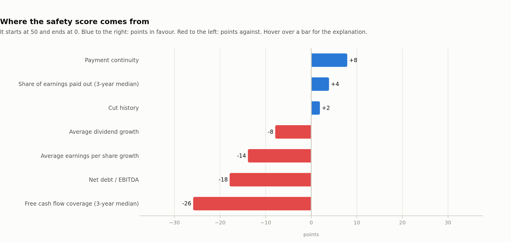

# SET X-Ray

Analysis of the **last ten years of dividends** of a **Stock Exchange of
Thailand** share, with a trading signal that explains itself.

Give it a symbol — `PTT`, `AOT`, `CPALL` — and the tool reconstructs every
payment of the last ten years, measures growth, cuts and continuity, works out
how much of the return came from the coupons rather than from the price, judges
whether the dividend will hold, estimates what it will pay over the next two
years, and answers a single question:

> **Do I buy, hold or sell? And why?**

The horizon is **one to two years at the very least**. This is not a trading
tool.

**In English or in Italian**, with a switch in the sidebar — and the language
changes every word the tool writes: the analyst's prose, the charts, the report,
the terminal. It also changes every figure, because the two languages do not
write numbers the same way (`1,234.50` against `1.234,50`, `98.3bn` against
`98,3 mld`).



The same screen with the switch on Italian. Note the numbers, not only the
words: `62,59 THB`, `+29,3%`, `11/09/2026`.



The case that matters: ten years of payments with the 2020 cut marked in red and
the estimate for the next two years with its range.



How much of the return came from the coupons and how much from the price.



Where the safety score comes from, factor by factor.



---

## Trying it from a phone

Nothing to install: **[interactive preview](https://claude.ai/code/artifact/a40605c8-4d90-44da-83c7-c7ddcb5fa1a1)**
with six test companies and the real output of the analysis engine, in either
language (the EN/IT switch is top right, and it remembers your choice).
Synthetic data, there to show how the tool reasons.

For **real stocks** the app has to be online, because the analysis runs in
Python and fetches the data on the spot. That is free on Streamlit Community
Cloud, and can be done from a phone browser:

**[Pre-filled publishing form](https://share.streamlit.io/deploy?repository=giancarlo1963%2Fstock-exchange&branch=claude%2Fthailand-equity-analyzer-rfrfkp&mainModule=app.py)**
— sign in with GitHub, press *Deploy*, wait a couple of minutes. You get an
address of your own to add to the home screen.

One warning about that route: Yahoo Finance rate-limits by IP address, and on a
shared service you hit the limit more often than from home. If that happens,
wait a few minutes or supply the dividends by CSV (see below), which depends on
no API at all.

## Local install

Needs Python 3.10 or later.

```bash
pip install -r requirements.txt
streamlit run app.py
```

From the terminal:

```bash
python -m setxray PTT                   # full analysis
python -m setxray PTT --dividends       # the ten-year dividend section only
python -m setxray --sources             # which archives are active
python -m setxray AOT --report aot.md   # save the report as markdown
python -m setxray demo:tagliato         # made-up data, no internet
python -m setxray PTT --lang it         # in Italian (or SETXRAY_LANG=it)
```

The flags stay in English — they are an interface, like `--help` — but
everything the command prints follows `--lang`.

As a library:

```python
from setxray import analyze
from setxray.lang import using

a = analyze("PTT")
print(a.dividends.signal.action)            # "BUY" - an identifier, never translated
print(a.dividends.signal.headline)          # "BUY for the dividend - medium conviction"
print(a.dividends.yield_stats["attuale"])   # 0.0612
print(a.dividends.safety.score)             # 71

with using("it"):                           # the language is chosen per analysis
    print(analyze("PTT").report())
```

The language is picked when the analysis runs, because the sentences are built
inside the engine and stored in the result. `action` and the other fields the
code compares stay stable identifiers in both languages; only the words meant
for a reader are translated.

### Without internet

Six invented companies cover the typical cases. The numbers are synthetic and
the companies do not exist.

| Profile | What it represents |
|---|---|
| `demo:dividendo` | a generous coupon, growing for ten years, at a reasonable price |
| `demo:tagliato` | **cut by 55% in 2020**: yields 14% today because the price collapsed |
| `demo:irregolare` | pays only in good years, skipping four out of ten |
| `demo:solida` | a growing company, healthy accounts, priced below its own average |
| `demo:cara` | a good company paid far more than it has ever been worth |
| `demo:difficolta` | pays nothing: losses, debt, negative cash flow |

`demo:tagliato` is the one that matters most: it shows how the tool tells a high
yield caused by a stock trading at a discount apart from a high yield caused by a
market expecting another cut.

---

## Where the data comes from

On Thai stocks the dividend is the figure that is easiest to get wrong: Yahoo
Finance sometimes skips a payment, sometimes confuses baht and satang, sometimes
records the date a few days out. Over ten years those errors change the
conclusions.

That is why the tool **queries several archives, keeps the longest series and
declares where the sources disagree** — with no attempt to reconcile them:
knowing that two archives diverge is worth more than an average of the two.

| Source | Key | How to activate it | Notes |
|---|---|---|---|
| **SET (official website)** | not needed | active | The authoritative source. Its public interface is undocumented: the tool tries several addresses, and you can force your own with `SETXRAY_SET_API`. **Check the result on first use.** |
| **Local CSV file** | not needed | active | Always works, depends on no API. See below. |
| **EOD Historical Data** | `EODHD_API_KEY` | free key at eodhd.com | Good coverage of Asian dividends. |
| **Financial Modeling Prep** | `FMP_API_KEY` | free key at financialmodelingprep.com | Limited free plan. |
| **Alpha Vantage** | `ALPHAVANTAGE_API_KEY` | free key at alphavantage.co | 25 calls a day; `.BKK` suffix. |
| **Yahoo Finance** | not needed | active | Always available, the least reliable on SET stocks: it stays the fallback. |

```bash
export EODHD_API_KEY=...           # activate a source
export SETXRAY_SOURCES=csv,yahoo    # restrict the sources (faster)
python -m setxray --sources          # check what is active
```

### The route that always works: the CSV

No API is guaranteed to last. This one is. Copy the table of payments from the
SET website and save it as `data/<SYMBOL>-dividends.csv`:

```
date,dividend
2016-04-25,1.10
2016-09-05,1.10
2017-04-24,1.20
```

`data,importo` works too, as do the semicolon as a separator and the comma as a
decimal mark. **Dates are read day before month**, the way the SET writes them
(`05/09/2024` is 5 September). The file is treated as the most reliable source
and used instead of the APIs.

Prices, financial statements and cash flows come from Yahoo Finance: coverage
there is good even on SET stocks.

---

## What it computes, and how

### 1. Ten years of distribution

Dividend per share year by year, with the year in progress kept out of every
average (it is incomplete by definition). Average growth over 3, 5 and 10 years;
cuts with their year and their size; skipped years; consecutive increases; the
payment cadence.

Two details that change the numbers:

- **Cuts and increases are counted only between consecutive calendar years.** A
  stock that skips 2020 and 2021 has not "cut" on the way from 2019 to 2022.
- **With a zero year inside the window, average growth is not computed.** On an
  irregular payer a CAGR means nothing, and declaring it absent is more useful
  than inventing it.

### 2. How much of the return came from the coupons

Ten-year total return with the dividends reinvested at each payment, against the
price alone. On an income stock this is the number that says whether the promise
was kept: a price flat for ten years while collecting 6% a year is not a failed
investment. **The share can exceed 100%**: if the price fell, the coupons
produced the entire return and covered the loss as well.

### 3. Is today's price generous?

The current yield is compared with **its own** history, not with a market
average: more than two thousand daily observations over ten years, with median,
quartiles and percentile.

One detail that looks technical and is not: the historical series and today's
yield use **the same measure** (the last N payments annualised, N being the usual
cadence). A 365-day window over payments on near-fixed dates captures now two and
now one depending on the day, and the percentile would end up comparing two
different things.

### 4. Will the dividend hold?

A 0-100 score that starts at 50 and adds the points of seven factors, **each one
visible with its points and its explanation**: share of earnings paid out, cover
from real free cash flow, net debt/EBITDA, the trend in earnings, the history of
cuts, payment continuity, dividend growth.

It is **a stated rule, not a statistical model trained** on a historical database
of cuts. The advantage is that you can see where the number comes from and
disagree on a factor.

Three corrections learned from the real cases:

- Dividend growth uses the **more prudent** of the 5- and 10-year measures: after
  a cut, the five-year average measures the climb back from the low and would
  reward precisely the company that cut.
- A company that **skips years** cannot pass 45 points (35 if it skips three or
  more), however prudent the payout in the years it does pay.
- A yield above **1.7 times** its own median raises the cut risk: when the coupon
  yields far more than usual, the market is normally already pricing something
  in.

### 5. What it will pay over the next two years

Three independent methods, weighted and kept visible: **damped historical trend**
(past growth taken at 60%, because a straight line through logarithms
extrapolates with too much confidence), **payout ratio on expected earnings**,
**share of free cash flow**. What comes out is a range, not a single number. When
cut risk is high, the pessimistic scenario assumes a reduction of 40-50%.

### 6. The signal, and why

The valuation is the yield reverting towards its median: if the stock has
historically yielded 5% and yields 7% today, then with the dividend confirmed the
"normal" price is higher. Two years of collected coupons are added to that.

Three brakes, all of them born from errors seen in testing:

- **Reversion to the median is assumed only halfway.** If the price has had a
  long trend, the old median describes a company and a market different from
  today's.
- **A fragile dividend permanently deserves a higher yield.** Below 60 points of
  safety the target yield is raised by up to 90%: anyone assuming a return to the
  old median is betting that the company becomes what it used to be.
- **When a cut is likely, the stock is valued on the cut dividend.** This is the
  most expensive mistake a dividend model can make: without this correction the
  `demo:tagliato` profile produced **+112%** of expected two-year return on a
  company whose dividend was at risk. With the correction it produces -35%.

Entry price, estimated value and trim price all come out of the same target
yield, so the three numbers do not tell different stories: you buy when the
coupon yields a fifth more than the stock deserves, you trim when it yields a
fifth less.

### 7. Has the signal ever worked on this stock?

This part is measured, not asserted. For every month-end of the last ten years
the tool looks at which percentile the yield sat in against the previous three
years, and measures the total return of the **following two years**. Then it
compares the groups.

The limits are declared next to the result: one stock, one period, overlapping
two-year windows (the independent observations are far fewer than those counted).
If a group has fewer than six observations the comparison is not made. It is a
hint about how this stock behaved, not a general rule.

### Around the dividends: the fundamental analysis

The general analysis is still there — valuation, business quality, growth,
financial strength, price trend, four valuation models — because that is what
says whether the coupon is supported by the accounts. **When the two models
disagree, the app says so** instead of averaging them: they look at different
things, and the divergence is informative. On `demo:tagliato` the general model
sees a stock at a discount on earnings and the dividend model sees a coupon that
will not hold: the classic profile of a value trap.

---

## Structure

```
app.py                 web interface (Streamlit)
setxray/
  sources/             the alternative sources
    base.py            abstraction, defensive JSON reading, comparison of sources
    setofficial.py     official SET website · csvfile.py  local file
    eodhd.py · fmp.py · alphavantage.py · yahoo.py
  dividends.py         the engine: history, safety, forecast, signal, backtest
  datasource.py        prices and statements from Yahoo Finance, cache, SET symbols
  metrics.py           statements -> metrics (margins, ROE/ROIC, debt, multiples)
  valuation.py         four valuation models and the cost of equity
  scoring.py           five pillars, red flags, general verdict
  narrative.py         the written analysis + markdown report
  charts.py            eighteen charts (Plotly)
  engine.py            analyze(): the thread that ties it together
  lang.py              the language: one choice, two words for every sentence
  cli.py · demo.py · fmt.py
mobile/setxray.html    the phone preview: one static page, hand-drawn SVG charts
tools/export_preview.py  runs the engine on the demo profiles -> mobile/dati.js
tools/dump_strings.py    prints every string the app shows, in one language
tools/check_languages.py compares the two languages and reports what lags behind
tests/                 319 tests, all runnable without a network
```

The phone preview is a static page, so it cannot run Python: the engine's output
is computed once for both languages and written beside it as a JavaScript file.

```bash
python tools/export_preview.py mobile/dati.js
```

### How the two languages are held

The two versions of a sentence are written side by side, where the sentence is
built:

```python
out.append(L("It has never reduced the dividend in the 10 years observed.",
             "Non ha mai ridotto il dividendo nei 10 anni osservati."))
```

Not a catalogue of keys (`t("dividend.no_cuts")`). The analyst's prose carries
its grammar inside — singulars, plurals, agreements — so the two languages are
two sentences, not one sentence with holes in it. Written this way they sit on
adjacent lines: you cannot change one and forget the other without seeing it.

Everything a reader sees is translated. Everything the code compares is not:
`action` stays `"BUY"`, dictionary keys stay `"past"` and `"source"`, chart keys
stay `"dividend_history"`. This is the one real trap of a bilingual tool, and it
cost us a live bug: a comparison written as `if reliability == "bassa"` kept
working in Italian and went quiet in English, so one red flag stopped being
raised. Where the code needs to branch on a value the user also reads, the value
now comes in two fields — `reliability` for the reader, `reliability_key` for the
code — and `tools/check_languages.py` renders everything in both languages and
reports anything that comes out identical.

The code's own internal names and comments stay in Italian, the language this was
built in.

The charts follow two non-negotiable rules: **never two vertical axes** in the
same panel (two different units become two charts), and the palette is verified
for colour blindness with the value always written beside the colour.

## Tests

```bash
python -m pytest tests/ -q
```

They never touch the network, and must not: they use the demo profiles, a
simulated `yfinance` and the real JSON responses of every service recorded as
fixtures (including Yahoo not answering, empty responses and renamed columns).

`tests/test_lang.py` holds the bilingual ones: that the same analysis produces
the same numbers, the same structure and the same number of sentences in both
languages, that no identifier is translated, and that no English-formatted
number ends up inside an Italian sentence.

## Limits worth knowing

- **The dividend APIs were never tried against the real services** during
  development: the network of the working environment blocked all of them. The
  shapes of the responses are covered by the tests, but **check the result on
  first use** — the command `python -m setxray PTT --dividends` shows at the
  bottom which source was used and whether the others agree. The CSV route does
  not carry that doubt.
- **Yahoo Finance gives four financial years**, not ten: payout and cash cover
  can only be reconstructed for the last four years, while dividends and prices
  cover a full ten.
- **Yahoo rate-limits requests.** There is a one-hour local cache
  (`~/.cache/setxray`); if you get errors, wait a few minutes.
- **The exchange rate is not forecast.** The stock is in baht: for anyone
  investing in euros the final return also depends on EUR/THB.
- **The dividend forecast is an extrapolation from the financial statements**, not
  a reading of the company's intentions. An investment announcement, an
  acquisition or a change of distribution policy are not in it.

## Warning

This application is an automated elaboration of public data. **It is not
financial advice and it is not a personalised recommendation.** Before investing,
always check the figures against the company's official statements and the Stock
Exchange of Thailand website, and consider your own situation.
