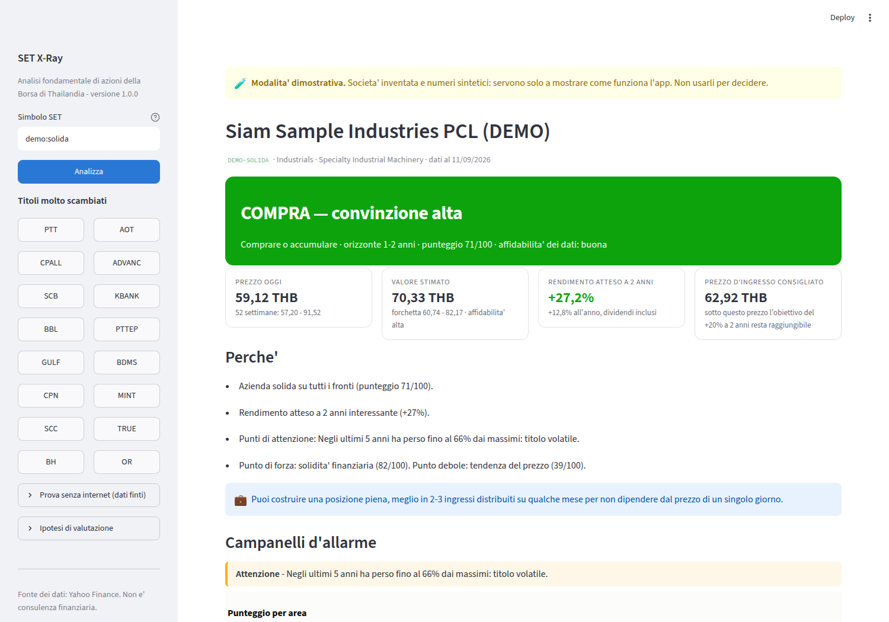

# SET X-Ray

Analisi fondamentale di un'azione della **Stock Exchange of Thailand (SET)**.

Dai un simbolo — `PTT`, `AOT`, `CPALL` — e l'app scarica tutti i dati pubblici
che trova, li rilegge con i criteri di un analista fondamentale e risponde a una
sola domanda:

> **Compro, mantengo o vendo?**

L'orizzonte è **1-2 anni minimo**. Non è uno strumento di trading: la tendenza
del prezzo pesa solo per il 15% del giudizio, il resto sono conti aziendali.



---

## Installazione

Serve Python 3.10 o successivo.

```bash
pip install -r requirements.txt
```

## Uso

### Interfaccia web (consigliata)

```bash
streamlit run app.py
```

Si apre nel browser. Scrivi il simbolo e premi **Analizza**. L'indirizzo
contiene il titolo (`...?simbolo=PTT`), quindi puoi salvarlo nei preferiti.

### Da terminale

```bash
python -m setxray PTT                       # analisi a schermo
python -m setxray AOT --report aot.md        # salva anche il report in markdown
python -m setxray CPALL --grafici grafici/   # esporta i grafici in PNG
python -m setxray demo:solida                # dati finti, senza internet
```

Opzioni utili: `--tasso` e `--premio` cambiano le ipotesi di valutazione,
`--no-cache` forza il riscarico, `--svuota-cache` ripulisce.

### Come libreria

```python
from setxray import analyze

analisi = analyze("PTT")
print(analisi.verdict.headline)          # "COMPRA — convinzione media"
print(analisi.verdict.expected_return_2y) # 0.27
print(analisi.report())                   # report completo in markdown
```

### Senza internet

Quattro aziende inventate coprono i casi tipici, per capire come funziona
l'analisi prima di usarla sul serio:

| Profilo | Cosa rappresenta |
|---|---|
| `demo:solida` | cresce, conti sani, prezzo sotto la sua media storica |
| `demo:cara` | buona azienda pagata molto più di quanto è mai valsa |
| `demo:difficolta` | ricavi in calo, debito alto, cassa negativa |
| `demo:dividendo` | utility stabile con dividendo generoso |

I numeri sono sintetici e le società non esistono.

---

## Come arriva alla conclusione

### 1. Raccoglie i dati

Da Yahoo Finance (`yfinance`), che per i titoli SET espone di norma **oltre
dieci anni di prezzi**, gli **ultimi quattro esercizi** di conto economico,
stato patrimoniale e rendiconto finanziario, i trimestrali, i dividendi, lo
storico dei multipli e — quando il titolo è coperto — le stime degli analisti.
Come riferimento di mercato usa l'indice SET (`^SET.BK`).

Dove un dato manca, l'app **lo dichiara**: non lo stima e non lo inventa. La
scheda *Dati e limiti* elenca cosa è stato trovato e cosa no.

### 2. Assegna un punteggio: cinque aree, 0-100

| Area | Peso | Domanda |
|---|---|---|
| Valutazione | 25% | Il prezzo è basso o alto, rispetto agli utili e alla storia del titolo? |
| Qualità del business | 20% | Guadagna bene sul capitale che impiega, con margini stabili? |
| Crescita | 20% | Ricavi e utili crescono, e con continuità? |
| Solidità finanziaria | 20% | Il debito è sostenibile? Regge un anno brutto? |
| Tendenza del prezzo | 15% | Il mercato conferma o smentisce la tesi? |

Ogni area è la media ponderata di 5-7 indicatori (ROE, ROIC, margini, debito
netto/EBITDA, copertura interessi, percentile del P/E sulla propria storia…).
Gli indicatori senza dato non pesano, e la loro assenza abbassa l'affidabilità
dichiarata.

Per **banche e assicurazioni** i pesi cambiano: EV/EBITDA e debito netto non
significano nulla, quindi contano di più P/B, ROE e patrimonio sull'attivo.

### 3. Stima quanto vale, con quattro modelli indipendenti

| Modello | Quando si applica |
|---|---|
| Multiplo storico (P/E) | utile positivo; il multiplo mediano del titolo, limitato dal P/E giustificato |
| Dividendi scontati (Gordon) | solo se il dividendo è la fonte principale del rendimento |
| Flussi di cassa scontati | cassa libera positiva; crescita che sfuma verso il 2,5% in 5 anni |
| Valore di libro giustificato (P/B) | ROE positivo; multiplo limitato anche dal P/B storico |

I quattro valori restano **visibili uno per uno**, poi vengono mediati con pesi
che dipendono dal tipo di azienda. Il risultato è una forchetta —
pessimistico / centrale / ottimistico — non un numero secco.

Il tasso di sconto è il CAPM: tasso privo di rischio thailandese + beta × premio
per il rischio azionario, con un minimo del 9% (un'azione di un mercato
emergente non rende meno di così) e beta riportato dentro [0,4 - 1,8], perché
su titoli poco liquidi il beta stimato è rumore.

Il freno più importante è il **tetto del 4% alla crescita perpetua**: senza di
esso i modelli a crescita infinita esplodono appena la crescita si avvicina al
tasso di sconto. Se un'azienda è in perdita e senza cassa, nessun modello è
applicabile: l'app lo dice e ripiega su un riferimento patrimoniale,
dichiarando che non è una valutazione del business.

### 4. Decide

Il verdetto incrocia il punteggio (quanto è buona l'azienda) con il rendimento
atteso a due anni (quanto c'è da guadagnare), assumendo che il prezzo converga
al valore stimato entro l'orizzonte, dividendi inclusi.

Sopra a tutto stanno i **campanelli d'allarme**: patrimonio netto negativo,
interessi non coperti, perdite ripetute, ricavi in calo da tre anni, dividendo
sopra gli utili, diluizione forte. **Due problemi gravi portano a vendere anche
con un punteggio alto**, e uno solo basta a escludere l'acquisto. Un'azienda che
sta consumando il proprio patrimonio non diventa un affare perché costa poco.

Insieme alla decisione l'app dà il **prezzo d'ingresso** sotto il quale
l'obiettivo resta raggiungibile, come dimensionare la posizione, e **cosa deve
accadere per rimettere in discussione la tesi**.

---

## Struttura

```
app.py                 interfaccia web (Streamlit)
setxray/
  datasource.py        scarico da Yahoo Finance, cache su disco, simboli SET
  metrics.py           bilanci -> metriche (margini, ROE/ROIC, debito, multipli)
  valuation.py         i quattro modelli, il costo del capitale, la forchetta
  scoring.py           i cinque pilastri, i campanelli d'allarme, il verdetto
  narrative.py         passato / presente / futuro in italiano + report markdown
  charts.py            i grafici (Plotly)
  engine.py            il filo che unisce tutto: analyze()
  cli.py               interfaccia da terminale
  demo.py              dati sintetici per la modalità dimostrativa
  fmt.py               formattazione numerica italiana
tests/                 132 test, tutti eseguibili senza rete
```

I grafici seguono due regole non negoziabili: **mai due assi verticali** nello
stesso riquadro (due unità diverse diventano due grafici), e la palette è
verificata per il daltonismo, con il valore sempre scritto accanto al colore.

## Test

```bash
python -m pytest tests/ -q
```

Non toccano la rete: usano i dati dimostrativi e un `yfinance` simulato che
riproduce anche i casi scomodi (Yahoo che non risponde, risposte vuote, nomi di
colonna cambiati fra versioni).

## Limiti da conoscere

- **Yahoo Finance dà quattro esercizi di bilancio**, non dieci: le tendenze di
  lungo periodo sui fondamentali sono inevitabilmente brevi. I prezzi invece
  coprono oltre dieci anni.
- **La copertura dei titoli thailandesi è disomogenea**: sulle mid e small cap
  mancano spesso stime degli analisti e alcune voci di bilancio.
- **Yahoo limita le richieste.** L'app tiene una cache locale di un'ora
  (`~/.cache/setxray`); se ricevi errori, aspetta qualche minuto.
- **Il cambio non è previsto.** Il titolo è in baht: per chi investe in euro il
  rendimento finale dipende anche da EUR/THB.
- **I modelli sono modelli.** Le ipotesi sono scritte in chiaro nella scheda
  *Futuro* e si possono cambiare dalla barra laterale. Cambiando tasso e premio
  per il rischio, il valore stimato cambia: è il modo giusto di usarli.

## Avvertenza

Questa applicazione è un'elaborazione automatica di dati pubblici. **Non è
consulenza finanziaria e non è una raccomandazione personalizzata.** Prima di
investire verifica sempre i numeri sui bilanci ufficiali della società e sul
sito della Stock Exchange of Thailand, e considera la tua situazione personale.
